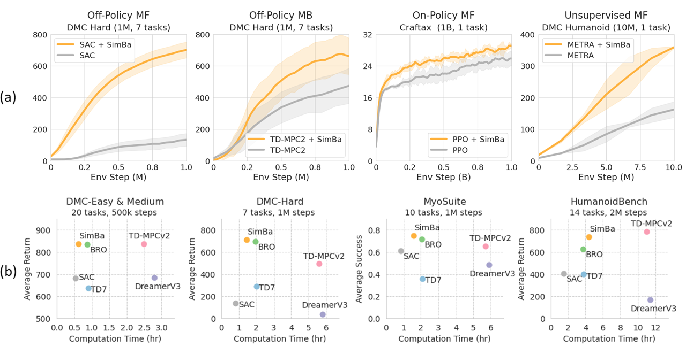

# SimBa: Simplicity Bias for Scaling Up Parameters in Deep RL

This is a repository of an official implementation of 

<i>Simba: Simplicity Bias for Scaling Up Parameters in Deep Reinforcement Learning </i> by

<a href="https://joonleesky.github.io">Hojoon Lee</a>,
<a href="https://godnpeter.github.io">Dongyoon Hwang</a>,
<a href="https://i-am-proto.github.io">Donghu Kim</a>,
<a href="https://mynsng.github.io">Hyunseung Kim</a>,
<a href="https://taijunjet.com">Jun Jet Tai</a>,
<a href="https://kausubbu.github.io">Kaushik Subramanian</a>, 

<a href="https://www.pwurman.org">Peter R. Wurman</a>,
<a href="https://sites.google.com/site/jaegulchoo">Jaegul Choo</a>,
<a href="https://www.cs.utexas.edu/~pstone/">Peter Stone</a>,
<a href="https://takuseno.github.io/">Takuma Seno</a>.


[[Website]](https://sonyresearch.github.io/simba) [[Paper]](https://arxiv.org/abs/2410.09754)

## Overview

SimBa is a network architecture designed for RL that avoids overfitting by embedding simplicity bias.


When integrated with Soft Actor Critic (SAC), SAC + SimBa matches performance to state-of-the-art off-policy algorithms by only changing the network architecture.




## Getting strated

### Docker

We provide a `Dockerfile` for easy installation. You can build the docker image by running

```
docker build . -t scale_rl .
docker run --gpus all -v .:/home/user/scale_rl -it scale_rl /bin/bash
```

### Pip/Conda

If you prefer to install dependencies manually, start by installing dependencies via conda by following the guidelines.
```
# Use pip
pip install -e .

# Or use conda
conda env create -f deps/environment.yaml
```

#### (optional) Jax for GPU
```
pip install -U "jax[cuda12]==0.4.25" -f https://storage.googleapis.com/jax-releases/jax_cuda_releases.html
# If you want to execute multiple runs with a single GPU, we recommend to set this variable.
export XLA_PYTHON_CLIENT_PREALLOCATE=false
```

#### Mujoco
Please see installation instruction at [MuJoCo](https://github.com/google-deepmind/mujoco).
```
# Additional environmental evariables for headless rendering
export MUJOCO_GL="egl"
export MUJOCO_EGL_DEVICE_ID="0"
export MKL_SERVICE_FORCE_INTEL="0"
```

#### (optional) Humanoid Bench

```
git clone https://github.com/joonleesky/humanoid-bench
cd humanoid-bench
pip install -e .
```

#### (optional) Myosuite
```
git clone --recursive https://github.com/joonleesky/myosuite
cd myosuite
pip install -e .
```


##  Example usage

We provide examples on how to train SAC agents with SimBa architecture.  

To run a single experiment
```
python run.py
```

To benchmark the algorithm with all environments
```
python run_parallel.py \
    --task all \
    --device_ids <list of gpu devices to use> \
    --num_seeds <num_seeds> \
    --num_exp_per_device <number>  
```

### Scripts

An example script to collect DMC results using SAC with Simba:
```
bash scripts/sac_simba_dmc_em.sh
bash scripts/sac_simba_dmc_hard.sh
bash scripts/sac_simba_hbench.sh
bash scripts/sac_simba_myosuite.sh
```

## Analysis

Please refer to `analysis/benchmark.ipynb` to analyze the experimental results provided in the paper.

## Development
Configure development dependencies:
```
pip install -r deps/dev.requirements.txt
pre-commit install
```

## License
This project is released under the [Apache 2.0 license](/LICENSE).

## Citation

If you find our work useful, please consider citing our paper as follows:

```
@article{lee2024simba,
  title={SimBa: Simplicity Bias for Scaling Up Parameters in Deep Reinforcement Learning}, 
  author={Hojoon Lee and Dongyoon Hwang and Donghu Kim and Hyunseung Kim and Jun Jet Tai and Kaushik Subramanian and Peter R. Wurman and Jaegul Choo and Peter Stone and Takuma Seno},
  journal={arXiv preprint arXiv:2410.09754},
  year={2024}
}
```
